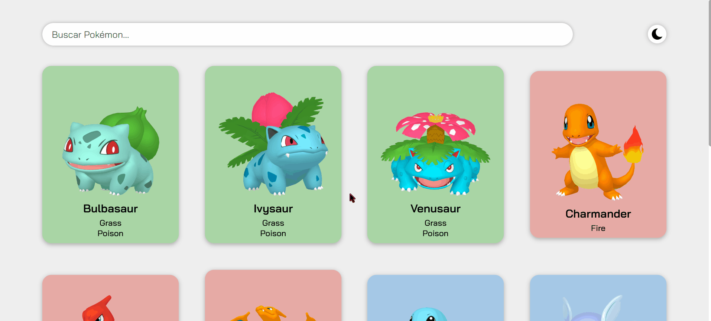

<h1 align="center">Projeto My Pokédex</h1>

<ol>
  <li>
    

      <h2>O que é?</h2>
      
É uma simulação de um teste técnico que o curso DevQuest proporcionou, a fim de testar nosso conhecimento com React e algumas bibliotecas dele!

    

  </li>

  <li>
    <h2>O que ele faz?</h2>
    
Este projeto tem diversas funcionalidades, e todas estarão mostradas abaixo, em vídeo, para uma melhor demonstração!

  </li>

  

    <h3>Interface simples!</h3>
    
  

  

    <h3>Alterne entre modos claro e escuro num clique!</h3>
    
  

  

    <h3>Pesquise um Pokémon específico ou busque por letras!</h3>
    
  

  

    <h3>Carregue mais Pokémons sempre que quiser!</h3>
    
  

  

    <h3>Veja as informações do Pokémon apenas clicando nele.</h3>
    
  

</ol>