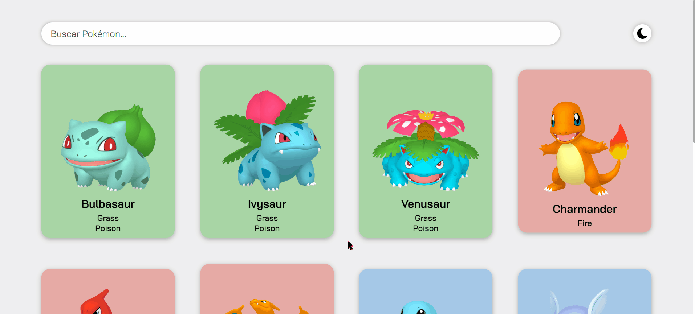

<h1 align="center">Projeto My Pokédex</h1>

  

    <h2>🤔 O que é?</h2>
    
É uma simulação de um teste técnico que o curso DevQuest proporcionou, a fim de testar nosso conhecimento com React e algumas bibliotecas dele!

  

  
  

    <h2>❓ O que ele faz?</h2>
    
Este projeto tem diversas funcionalidades, e todas estarão mostradas abaixo, em vídeo, para uma melhor demonstração!

    <ul> 
      <li>
        <h3>💻 Interface simples!</h3>
        
      </li>
      <li>
        <h3>☀️ Alterne entre modos claro e escuro num clique!</h3>
        
      </li>
      <li>
        <h3>🔍 Pesquise um Pokémon específico ou busque por letras!</h3>
        
      </li>
      <li>
        <h3>➕ Carregue mais Pokémons sempre que quiser!</h3>
        
      </li>
      <li>
        <h3>ℹ️ Veja as informações dos Pokémons apenas clicando nele.</h3>
        
      </li>
    </ul>
  

  

    <h2>🔧 Ferramentas Utilizadas</h2>
    <ul>
      <li> <strong>⚛️ React: </strong> foi usado para todo o projeto, a fim de melhorar nossa habilidade e a limpeza do código. </li>
      <li> <strong>🚓 React Router DOM:</strong> foi usado para a criação de um SPA (Single Page Application). </li>
      <li> <strong>👨🏼‍👩🏻‍👧🏻‍👦🏼 Context API: </strong> foi usada para a criação do alternador do modo de luz. </li>
      <li> <strong>🖌️ Styled Components: </strong> foi usado para todo o estilo do projeto, a fim de melhorar a limpeza do código e encontrá-lo mais rápido quando houver alterações. </li>
    </ul>
  

  

    <h2>📱 Como rodar o projeto?</h2>
    
Siga estes passos em um terminal de sua escolha (PowerShell, GitBash, etc)

    <ol>
      <li>👥 Clone o projeto com o comando <code>git clone https://github.com/DevHenriqueK/my-pokedex</code>  </li>
      <li>📦 Escreva o comando <code>npm install</code>, isso instalará os pacotes utilizados e implementará a pasta node_modules no projeto.</li>
      <li>🔗 Insira <code>npm run dev</code>. Um link para a página será disponibilizado. </li>
    </ol>
  

